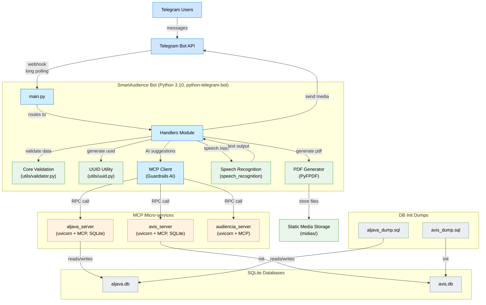

# INF0242-SmartAudience

SmartAudience é um bot do Telegram que gerencia audiências para a disciplina INF0242: Agentes Inteligentes e Sistemas Multi-Agentes da UFG.

## Funcionalidades

### Gerenciamento de Audiências
- Agendamento de audiências com validação de horários
- Verificação de conflitos de horários
- Sugestão automática de horários alternativos
- Listagem de agendamentos por período
- Consulta de agendamentos do dia
- Busca de agendamentos por número do processo

### Gestão de Participantes
- Cadastro de participantes com validação de CPF
- Controle de presença
- Identificação de participantes por tipo e código

### Documentação de Audiências
- Geração automática de termos de audiência em PDF
- Gestão de arquivos do processo
- Registro de impugnações
- Transcrição de audiências

## Tecnologias

- Python 3, uma linguagem de programação de alto nível e de propósito geral;
- Model Context Protocol (MCP), um protocolo que permite a criação e gerenciamento de contextos para modelos de IA;
- PyFPDF, uma biblioteca para geração de documentos PDF em Python;
- Python Telegram Bot, uma interface Python para a API do Telegram Bot;
- SQLite, um sistema de gerenciamento de banco de dados relacional leve e autocontido;
- Speech Recognition, uma biblioteca para reconhecimento de fala e conversão de áudio em texto.

# Integração

- Aljava, sistema de gerenciamento de mídias processuais da Justiça Federal no Rio Grande do Norte (JFRN);
- AVIS, sistema de agendamentos de audiências, vídeos e salas da JFRN.

## Diagrama Resumido do Projeto



## Configuração do ambiente de desenvolvimento

1. Instale o python, na versão 3.10, através do [link](https://www.python.org/downloads/);
2. Clone este repositório https://github.com/anunciado/INF0242-SmartAudience.git em sua máquina local;
3. Abra o projeto em sua IDE de preferência, como sugestão utilize o Visual Studio Code ou PyCharm;
4. Crie um ambiente virtual com o comando:
```
. python -m venv venv
```
5. Ative o ambiente virtual com o comando:
* No windows:
```
venv\Scripts\activate
```
* No linux:
```
source venv/bin/activate
```
6. Instale as bibliotecas no seu ambiente virtual a partir do arquivo _requirements.txt_ com o comando:
```
pip install -r requirements.txt
```
7. Crie um arquivo _.env_ na raiz do projeto como no exemplo arquivo _.env.sample_ com os seguintes parâmetros, alterando o DRIVER_PATH, colocando o path pro driver e API_TOKEN, uma senha pessoa para acesso as rotas.
```
TELEGRAM_BOT_TOKEN=seutoken
```
9. Execute o projeto com o comando:
```
python main.py
```
10. Instale o Claude Desktop através do [link oficial](https://claude.ai/desktop)
11. você deve editar um arquivo de configuração localizado em:
```
code $env:AppData\Roaming\Claude\claude_desktop_config.json
```
12. Uma vez com o arquivo aberto, adicione a seguinte configuração JSON, certificando-se de ajustar o caminho para refletir a localização correta do servidor MCP:
```
{
    "mcpServers": {
        "aljava_server": {
            "command": "uv",
            "args": [
                "--directory",
                "C://INF0242-SmartAudience//servers",
                "run",
                "aljava_server.py"
            ]
        },
        "avis_server": {
            "command": "uv",
            "args": [
                "--directory",
                "C://INF0242-SmartAudience//servers",
                "run",
                "avis_server.py"
            ]
        },
        "audiencia_server": {
            "command": "uv",
            "args": [
                "--directory",
                "C://INF0242-SmartAudience//servers",
                "run",
                "audiencia_server.py"
            ]
        }
    }
}
```
13. Inicie o o Claude Desktop instalado.

## Contribuição:

1. `Mova` a issue a ser resolvida para a coluna _In Progress_ no [board do projeto].  
2. `Clone` este repositório https://github.com/anunciado/INF0242-SmartAudience.git.
3. `Crie` um branch a partir da branch _dev_.
4. `Commit` suas alterações.
5. `Realize` o push das alterações.